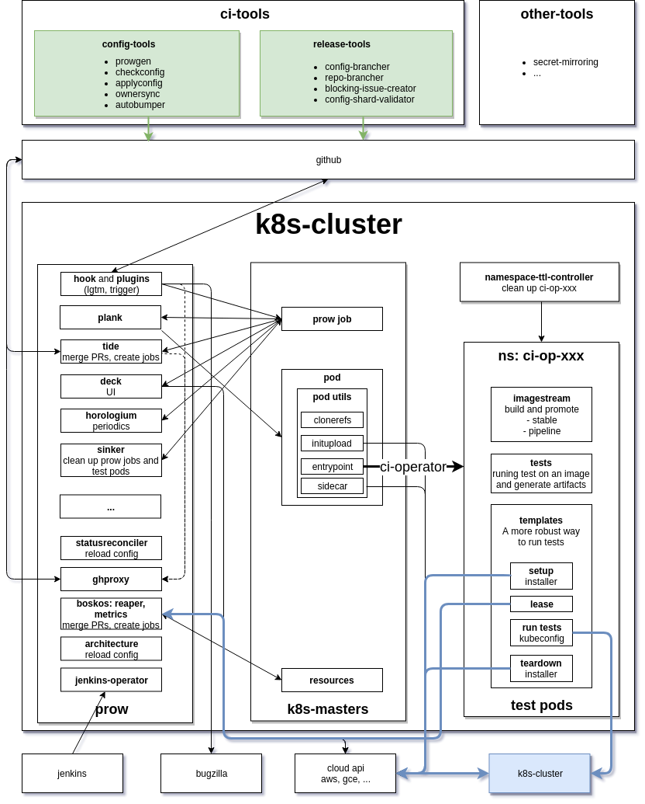

# dpcp architecture

[test-infra](https://github.com/kubernetes/test-infra).




## [prow](https://github.com/kubernetes/test-infra/tree/master/prow)

[elder's diagram](https://elder.dev/posts/prow/)

Upstream cluster: [config.yaml](https://github.com/kubernetes/test-infra/blob/master/prow/config.yaml); [plugin.yaml](https://github.com/kubernetes/test-infra/blob/master/prow/plugins.yaml); [job config folder](https://github.com/kubernetes/test-infra/tree/master/config/jobs)


### [prow components](https://github.com/kubernetes/test-infra/blob/master/prow/cmd/README.md#cluster-components)

* core components

    * deck: prow's UI frent-end

        * histogram on the UI: [Petr@slack](https://coreos.slack.com/archives/GB7NB0CUC/p1558533700292600).

    *  hook: receives [events](https://developer.github.com/webhooks/) from `github`. [plugins](https://github.com/kubernetes/test-infra/tree/master/prow/plugins): [are sub-components of hook](https://github.com/kubernetes/test-infra/blob/master/prow/plugins/README.md).
        * [approve](https://github.com/kubernetes/test-infra/tree/master/prow/plugins/approve/): [Reviewers and Approvers](https://github.com/kubernetes/test-infra/tree/master/prow/plugins/approve/approvers) and [its meaning in k8s community](https://github.com/kubernetes/community/blob/master/community-membership.md).
    * plank: manages the execution of prow jobs.
        TODO: check on [gcs_configuration section in plank's config](https://github.com/openshift/release/blob/master/cluster/ci/config/prow/config.yaml#L14-L21) from [Nikos](https://coreos.slack.com/archives/GB7NB0CUC/p1567690445207200).
    * horologium
    * sinker
* [tide](https://github.com/kubernetes/test-infra/blob/master/prow/cmd/tide/README.md): operates `github`'s PRs.

* auxiliary components
    * jenkins-operator
    * tot

### [ghproxy](https://github.com/kubernetes/test-infra/tree/master/ghproxy)

We use `ghproxy` to avoid [rate-limiting of api tokens](https://developer.github.com/v3/#rate-limiting).

[Q&A@slack](https://coreos.slack.com/archives/GB7NB0CUC/p1562767143290700) and [proxy lawyers in ghproxy](https://coreos.slack.com/archives/GB7NB0CUC/p1565793345353000).

Check `--github-endpoint` flag in the production to see which components use `ghproxy`. It should be _all of them_.

Understanding ghproxy: Steve: we have [the following layers](https://github.com/kubernetes/test-infra/blob/af1a26bf30f5f3776dba3b171899f400d3fe22ad/ghproxy/ghcache/ghcache.go#L205-L216):

> request --> http cache --> output throttle --> request coaleser --> github

In our production, [deployment](https://github.com/openshift/release/blob/master/cluster/ci/config/prow/openshift/ghproxy.yaml#L59) indicates we use
[`NewDiskCache`](https://github.com/kubernetes/test-infra/blob/master/ghproxy/ghproxy.go#L135-L142).
So we cache the requests by [`diskcache.NewWithDiskv`](https://github.com/kubernetes/test-infra/blob/af1a26bf30f5f3776dba3b171899f400d3fe22ad/ghproxy/ghcache/ghcache.go#L205-L216).

So let us start with [`cacheTransport := httpcache.NewTransport(cache)`](https://github.com/kubernetes/test-infra/blob/af1a26bf30f5f3776dba3b171899f400d3fe22ad/ghproxy/ghcache/ghcache.go#L227)
which returns a [`httpcache.Transport`](https://github.com/gregjones/httpcache/blob/master/httpcache.go#L99). We can also [customize](https://github.com/gregjones/httpcache/blob/master/httpcache.go#L102) its own `Transport` behavior:

> cacheTransport.Transport = newThrottlingTransport(maxConcurrency, upstreamTransport{delegate: delegate})

At last, the `http.RoundTripper`, `requestCoalescer` uses the `cacheTransport`.

A cache is an implementation of [http.RoundTripper](https://lanre.wtf/blog/2017/07/24/roundtripper-go/). In ghproxy, the customized cache is defined by `requestCoalescer`.

How do we tell our cache not to cache for a request?

`throttlingTransport` takes care of the connection to github.
So the logic should be embedded into its `RoundTrip` [function](https://github.com/kubernetes/test-infra/blob/af1a26bf30f5f3776dba3b171899f400d3fe22ad/ghproxy/ghcache/ghcache.go#L160).

[The way](https://github.com/kubernetes/test-infra/blob/af1a26bf30f5f3776dba3b171899f400d3fe22ad/ghproxy/ghcache/ghcache.go#L183-L185) to do it:

> resp.Header.Set("Cache-Control", "no-store")

where the meaning of the head is defined in [http protocol](https://developer.mozilla.org/en-US/docs/Web/HTTP/Headers/Cache-Control#Cacheability). So our cache lib "github.com/gregjones/httpcache" will use that header.

## test a prowjob

[how-to-test-a-prowjob](https://github.com/kubernetes/test-infra/blob/master/prow/build_test_update.md#how-to-test-a-prowjob)

## OpenShift CI

### Prow deployment

Our [prow deployment](https://github.com/openshift/release/tree/master/cluster/ci/config/prow/openshift):

```
$ oc get deployment -n ci -l app=prow
NAME                    DESIRED   CURRENT   UP-TO-DATE   AVAILABLE   AGE
artifact-uploader       1         1         1            1           273d
boskos-metrics          1         1         1            1           27d
boskos-reaper           1         1         1            1           38d
cherrypick              1         1         1            1           273d
deck                    1         1         1            1           273d
deck-internal           1         1         1            1           273d
ghproxy                 1         1         1            1           273d
hook                    2         2         2            2           273d
horologium              1         1         1            1           273d
jenkins-dev-operator    1         1         1            1           273d
jenkins-operator        1         1         1            1           273d
kata-jenkins-operator   1         1         1            1           273d
needs-rebase            1         1         1            1           273d
plank                   1         1         1            1           273d
refresh                 1         1         1            1           273d
sinker                  1         1         1            1           273d
statusreconciler        1         1         1            1           271d
tide                    1         1         1            1           273d
tot                     1         1         1            1           180d

```

Configuration:

* [configuration](https://github.com/openshift/release/blob/master/cluster/ci/config/prow/config.yaml) for prow-components: 
    > oc get configmaps -n ci config
* [prow plugins](https://deck-ci.svc.ci.openshift.org/plugins) and its [configurations](https://github.com/openshift/release/blob/master/cluster/ci/config/prow/plugins.yaml): eg, [approve](https://github.com/kubernetes/test-infra/blob/master/prow/plugins/approve/approvers/README.md):
    > oc get configmaps -n ci plugins

All the job configs are mounted via configMap for ALL prow's core components. Eg, check `hook`':

```
$ oc set volumes deployment hook -n ci | grep job-config
```

All prow components and prowjobs [are running in namespace](https://github.com/openshift/release/blob/master/cluster/ci/config/prow/config.yaml#L618-L619) `ci`.

### [ci-tools](https://github.com/openshift/ci-tools)

> Steve: flow of information is prow --> prowjob pod (running ci-operator) --> job pod (created by ci-operator, runs tests)

#### [ci-operator](https://github.com/openshift/ci-tools/tree/master/cmd/ci-operator)

[ci-operator readme on release repo](https://github.com/openshift/release/tree/master/ci-operator).

Starting from a config file for `ci-operator` under [`ci-operator/config/**/`](https://github.com/openshift/release/tree/master/ci-operator/config):


The config file is used in `configMap` [`ci-operator-master-configs`](https://github.com/openshift/release/blob/master/cluster/ci/config/prow/plugins.yaml#L1111-L1114) in `ns` `ci`:

```
$ oc get configmap -n ci ci-operator-master-configs -o yaml | grep openshift-ci-secret-mirroring-controller-master.yaml -A1
  openshift-ci-secret-mirroring-controller-master.yaml: |
    base_images:
```

`ci-operator-master-configs` will be used in the prowjobs defined in the [`ci-operator/jobs/**/`](https://github.com/openshift/release/tree/master/ci-operator/jobs).

### [ci-operator-prowgen](https://github.com/openshift/ci-tools/tree/master/cmd/ci-operator-prowgen)
The prowjobs configuration (they are NOT prowjob CRs) yaml files (`OWNERS` files as well) are generated by `ci-operator-prowgen`. See more [how2](https://github.com/openshift/ci-tools/blob/master/CI_OPERATOR_PROWGEN.md#tldr).

```
###https://github.com/openshift/release/tree/master/ci-operator#ci-operator
$ docker pull registry.svc.ci.openshift.org/ci/ci-operator-prowgen:latest
$ docker run -it -v $(pwd)/ci-operator:/ci-operator:z           \
  registry.svc.ci.openshift.org/ci/ci-operator-prowgen:latest \
  --from-dir /ci-operator/config/ --to-dir /ci-operator/jobs
```

Those generated job configuration files will be mounted to the pods of prow-components via configMap:

* `config-uploader` sync the changes on those files and the configMaps, eg, [`job-config-master-postsubmits`](https://github.com/openshift/release/blob/master/cluster/ci/config/prow/plugins.yaml#L1075-L1077).
* the configMaps, eg, `job-config-master-postsubmits` is [mounted to hook's pod](https://github.com/openshift/release/blob/master/cluster/ci/config/prow/openshift/hook.yaml#L105-L107).

Take a presubmit job [instance](https://prow.svc.ci.openshift.org/prowjob?prowjob=183d5e64-b9ee-11e9-a5f9-0a58ac10330c) for `ci-tools` itself: This prow job and its pod running in `ns` `ci`.
The pod runs `ci-operator`.


```
$ oc get prowjob -n ci 183d5e64-b9ee-11e9-a5f9-0a58ac10330c
NAME                                   JOB                                      BUILDID   TYPE        ORG         REPO       PULLS     STARTTIME   COMPLETIONTIME
183d5e64-b9ee-11e9-a5f9-0a58ac10330c   pull-ci-openshift-ci-tools-master-lint   197       presubmit   openshift   ci-tools   58        39m         38m

$ oc get pod -n ci 183d5e64-b9ee-11e9-a5f9-0a58ac10330c
NAME                                   READY     STATUS      RESTARTS   AGE
183d5e64-b9ee-11e9-a5f9-0a58ac10330c   0/2       Completed   0          35m
```

The job's [log](https://prow.svc.ci.openshift.org/view/gcs/origin-ci-test/pr-logs/pull/openshift_ci-tools/58/pull-ci-openshift-ci-tools-master-lint/197) has
`Using namespace ci-op-gp46wlf7`: The `ci-operator` creates
`ns` `ci-op-gp46wlf7` and does its task in it.

```
$ oc get all -n ci-op-gp46wlf7
NAME                                READY     STATUS      RESTARTS   AGE
pod/applyconfig-build               0/1       Completed   0          10m
pod/bin-build                       0/1       Completed   0          12m
pod/breaking-changes                0/2       Completed   0          10m
pod/ci-operator-build               0/1       Completed   0          10m
pod/ci-operator-checkconfig-build   0/1       Completed   0          10m
pod/ci-operator-prowgen-build       0/1       Completed   0          10m
pod/config-brancher-build           0/1       Completed   0          10m
pod/config-shard-validator-build    0/1       Completed   0          10m
pod/determinize-ci-operator-build   0/1       Completed   0          10m
pod/determinize-prow-jobs-build     0/1       Completed   0          10m
pod/format                          0/2       Completed   0          12m
pod/integration                     0/2       Completed   0          10m
pod/ipi-deprovision-build           0/1       Completed   0          12m
pod/lint                            0/2       Completed   0          12m
pod/pj-rehearse-build               0/1       Completed   0          10m
pod/repo-brancher-build             0/1       Completed   0          10m
pod/src-build                       0/1       Completed   0          12m
pod/unit                            0/2       Completed   0          12m

NAME                                               TYPE      FROM         STATUS     STARTED          DURATION
build.build.openshift.io/src                       Docker    Dockerfile   Complete   12 minutes ago   30s
build.build.openshift.io/bin                       Docker    Dockerfile   Complete   12 minutes ago   1m29s
build.build.openshift.io/ipi-deprovision           Docker                 Complete   12 minutes ago   1m4s
build.build.openshift.io/config-shard-validator    Docker                 Complete   10 minutes ago   58s
build.build.openshift.io/ci-operator-prowgen       Docker                 Complete   10 minutes ago   29s
build.build.openshift.io/config-brancher           Docker                 Complete   10 minutes ago   32s
build.build.openshift.io/ci-operator-checkconfig   Docker                 Complete   10 minutes ago   30s
build.build.openshift.io/determinize-ci-operator   Docker                 Complete   10 minutes ago   33s
build.build.openshift.io/determinize-prow-jobs     Docker                 Complete   10 minutes ago   33s
build.build.openshift.io/ci-operator               Docker                 Complete   10 minutes ago   1m3s
build.build.openshift.io/pj-rehearse               Docker                 Complete   10 minutes ago   1m2s
build.build.openshift.io/repo-brancher             Docker                 Complete   10 minutes ago   31s
build.build.openshift.io/applyconfig               Docker                 Complete   10 minutes ago   34s

NAME                                      DOCKER REPO                                             TAGS                                                          UPDATED
imagestream.image.openshift.io/pipeline   registry.svc.ci.openshift.org/ci-op-gp46wlf7/pipeline   ci-operator,pj-rehearse,config-shard-validator + 15 more...   9 minutes ago
imagestream.image.openshift.io/stable     registry.svc.ci.openshift.org/ci-op-gp46wlf7/stable     ci-operator,pj-rehearse,config-shard-validator + 8 more...    9 minutes ago

```

The builds are from the `images` defined in [the job config](https://github.com/openshift/release/blob/master/ci-operator/config/openshift/ci-tools/openshift-ci-tools-master.yaml#L19).

The pods [for tests in th econfig](https://github.com/openshift/release/blob/master/ci-operator/config/openshift/ci-tools/openshift-ci-tools-master.yaml#L129) (`oc get pod -n ci-op-gp46wlf7 | grep -v build`) are generated from the prowjob pod `183d5e64-b9ee-11e9-a5f9-0a58ac10330c` in `ns` `ci`.

Practice this `ci-tools` with [ci-secret-mirroring-controller](https://github.com/openshift/ci-secret-mirroring-controller):

* Enable `tide` for the repo: [release/pull/4601](https://github.com/openshift/release/pull/4601)
* Configure `OWNERS` of the repo: [ci-secret-mirroring-controller/pull/5](https://github.com/openshift/ci-secret-mirroring-controller/pull/5)
* Enable `approve`-plugin for the repo: [release/pull/4603](https://github.com/openshift/release/pull/4603)
* Follow [ONBOARD.md](https://github.com/openshift/ci-tools/blob/master/ONBOARD.md) to configure prowJobs for the repo: [release/pull/4583](https://github.com/openshift/release/pull/4583): `config` first, then [generate](https://github.com/openshift/ci-tools/blob/master/ONBOARD.md#add-prow-jobs) the jobs and `OWNERS` files.

```
$ JOB_SPEC='{"type":"periodic","job":"periodic-ci-azure-e2e-applysecurityupdates","buildid":"21","prowjobid":"ec28bec2-b7a4-11e9-af8e-0a58ac108dbc","extra_refs":[{"org":"openshift","repo":"openshift-azure","base_ref":"master"}]}' ./ci-operator --config /home/hongkliu/go/src/github.com/openshift/release/ci-operator/config/openshift/ci-secret-mirroring-controller/openshift-ci-secret-mirroring-controller-master.yaml --git-ref openshift/ci-secret-mirroring-controller@master --dry-run

```

[Templates](https://github.com/openshift/ci-tools/blob/master/TEMPLATES.md) and [how2use it for e2e tests with ci-operator](https://github.com/openshift/release/tree/master/ci-operator#end-to-end-tests)

TODO: practice testing with templates

### Multi-Stage Tests

* [Multi-Stage Tests Design Document](https://docs.google.com/document/d/1md-1BMf4_7mtKgGVoeZ3jOh4zSIBSjwl6vTTAYESwIM/edit#heading=h.5q65z4jr37ls)

## config tools

* ci-operator-prowgen

## release tools

[gdoc](https://docs.google.com/document/d/1USkRjWPVxsRZNLG5BRJnm5Q1LSk-NtBgrxl2spFRRU8/edit), src: ci-tools

Those tools manage repos with the following stanza in their config files:

```
promotion:
  namespace: ocp
  name: 4.2

```

Workflow:
* repos: e.g., [openshift/origin](https://github.com/openshift/origin) with

    * the developing branch: master
    * the current release branch: 4.2
    * the future release branch: 4.3

    developers create PRs against dev-branch (master), when they got merged, [periodic-openshift-release-fast-forward](https://github.com/openshift/release/blob/99d102d253904d6ddf5337e2e09c22d01782f709/ci-operator/jobs/openshift/release/openshift-release-periodics.yaml#L620-L654) sync the commits from the developing branch (master) to the current release branch (4.2) and the future release branch (4.3).

* ci-images: container images are build by post-submit jobs, e.g., [branch-ci-openshift-origin-master-images](https://github.com/openshift/release/blob/99d102d253904d6ddf5337e2e09c22d01782f709/ci-operator/jobs/openshift/origin/openshift-origin-master-postsubmits.yaml#L17)

    * merge to the developing branch (master): images are pushed to `is` ocp/{current-release-branch}:{component} (ocp/4.2)
    * merge to the current release branch (4.2): images are pushed nowhere [disabled: true](https://github.com/openshift/release/blob/391718206146563b303a4a972fce4c666b7f2ee1/ci-operator/config/openshift/ocs-operator/openshift-ocs-operator-release-4.2.yaml#L39)
    * merge to the current release branch (4.2): images are pushed to `is` ocp/{future-release-branch}:{component} (ocp/4.3) from the code on branch 4.3.

Those tools changes files automatically while we need to make-commits, push-to-remote, and create-PR manually.

* determinize-ci-operator
* config-brancher
* blocking-issue-creator
* repo-brancher

Install them locally (for the local test below):

```
$ cd ci-tools
$ make install
```

### Switch development branches
Example PR: [release/pull/5144](https://github.com/openshift/release/pull/5144)

```
$ cd /tmp/
$ git clone https://github.com/openshift/release
$ cd release/
### back to the status before the PR
$ git reset --hard 391718206146563b303a4a972fce4c666b7f2ee1

### format config files
$ determinize-ci-operator --config-dir ./ci-operator/config --current-release 4.2 --future-release 4.3 --confirm
### git-diff/add/commit

### bumper config: release branch will be 4.3
$ config-brancher --config-dir ./ci-operator/config --current-release 4.2 --future-release 4.3 --bump-release 4.3 --confirm
### git-diff/add/commit

### generate job configs based on the changes above
$ ci-operator-prowgen --from-dir ./ci-operator/config --to-dir ./ci-operator/jobs

### manually modify release's periodic job yaml file: from `4.2 to 4.3` to `4.3 to 4.4`
### periodic-openshift-release-fast-forward
### periodic-openshift-release-merge-blockers
### git-diff/add/commit

### git-push/creating-PR

```


### Blocking Issue Creation
`blocking-issue-creator`: maintain the github-issues to blocker merges against the developing branch (master), e.g.,
[openshift/origin/issues/22576](https://github.com/openshift/origin/issues/22576): It lists the branches which are fast-forwarded by the `periodic-openshift-release-fast-forward` and thus protected from PR merges.
Those issues are maintained by `periodic-openshift-release-merge-blockers`.

```
release-4.2
release-4.3

```

If we do it manually (we do not need to since `periodic-openshift-release-merge-blockers`):

```
### Petr: forgot to ask the command that you run. Is the following correct?
$ blocking-issue-creator --config-dir ./ci-operator/config \
                       --current-release 4.3             \
                       --future-release  4.4           \
                       --username foo --token-path /bar  \
                       --confirm

```

Then, the issue has the new branches protected:

```
release-4.3
release-4.4
```

So `release-4.2` becomes a RELEASED branch.

Qs after [reading](https://coreos.slack.com/archives/CHY2E1BL4/p1572045689085700):

* `blocking-issue-creator` [searches for](https://github.com/openshift/ci-tools/blob/02257615e22f89e7d746d15593116c8b14193c90/cmd/blocking-issue-creator/main.go#L226) the label `tide/merge-blocker`. Is it tide to maintain the labels? Why did not tide do its job for repo `kubevirt/hyperconverged-cluster-operator`?

### Branch Creation and Fast-Forwarding

`repo-brancher`: create and fast-forward protected branches of repos. If we do it manually (we do not need to since `periodic-openshift-release-fast-forward`):

```
repo-brancher --config-dir ./ci-operator/config \
              --current-release 4.3             \
              --future-release  4.4           \
              --fast-forward                    \
              --username foo --token-path /bar  \
              --confirm

```

### Generate 4.4 configs and jobs

https://github.com/openshift/release/pull/5169

https://coreos.slack.com/archives/GB7NB0CUC/p1569344963320900

More for 4.5: https://coreos.slack.com/archives/GB7NB0CUC/p1574706364052700

### Addition tasks for the RELEASED branches
TODO

* labels on github PRs
* bugzilla plugin: [4.3 cutting example](https://github.com/openshift/release/pull/6042)

### build-cop

### ci-search

### others

* [image-mirror setup requests](https://coreos.slack.com/archives/GB7NB0CUC/p1558533720293300)
