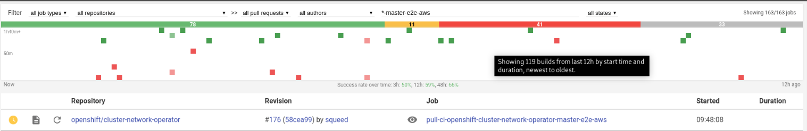

# build cop

* [OpenShift - Build Cop Responsibilities](https://docs.google.com/document/d/117_0UE5jJI_MyI5ugy1psn0Ls6fWCu-Y9jiZZPM4qzw/edit?ts=5c7d4ca0#)
* [OpenShift - Build Cop Triage](https://docs.google.com/document/d/1yMPat99lwqILIytCn-o6ZSEy1AOwTZBRI0jKqLGD2p8/edit#heading=h.i9cwtxk0yza5)

## success rate on deck



Thanks to Petr:

* colored bar: 24h (suc: 78, pen: 11, fai: 41, abo: 33). Success rate: 78/(78+41)=65%.
* histogram: 12h (counting the squares ... suc/green: 16; fai/red: 11). Success rate: 16/(16+11)=59%

Those rates match `Success rate over time: 3h: 50%, 12h: 59%, 48h: 66%`. The only issue is the hovering message `Showing 119 builds from last 12h ...` should be `Showing 27 ...`.

`1h40m+` and `50m` are job durations.

## Tools

### [search.svc](https://search.svc.ci.openshift.org/)

src: https://github.com/openshift/ci-search

```
$ oc get route --all-namespaces  | grep search
ci-search-next                     ci-search                                 ci-search-ci-search-next.svc.ci.openshift.org                               ci-search                                 8080-tcp     edge                 None
ci-search                          search                                    search.svc.ci.openshift.org                                                 search                                    <all>        edge/Redirect        None
```

### [search-next.svc](https://ci-search-ci-search-next.svc.ci.openshift.org)

### [rh@test-grid](https://testgrid.k8s.io/redhat-openshift-release-blocking)

A better visualization tool for test results. Have the links back to prow.

## Questions

* prow:
    * build-log is missing? 
    
        `Unable to retrieve container logs for docker://8bbd3de524981278248673ab98a41a43d364fa24e6a9f418ceeccce6dab15413`
* `search svc`:
    * context? build-log vs junit?
    * `search-next` vs `search`: the former is bigger?
    * which line should be used as keyword for search? Eg, in [this build log](https://prow.svc.ci.openshift.org/log?job=rehearse-3842-pull-ci-openshift-builder-master-e2e-aws&id=30)

            level=error msg="Error: Invalid index"
    
            Container setup exited with code 143, reason Error

            level=fatal msg="failed to fetch Cluster: failed to generate asset \"Cluster\": failed to create cluster: failed to apply using Terraform"

        
            {"component":"entrypoint","error":"wrapped process failed: exit status 1","level":"error","msg":"Error executing test process","time":"2019-05-27T13:51:00Z"}
    * diff from `Stackdriver`? Access issue as well.

* `internal whiteboard` in bz: try the query again after getting access.
